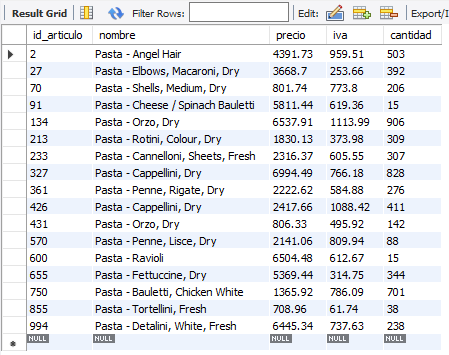
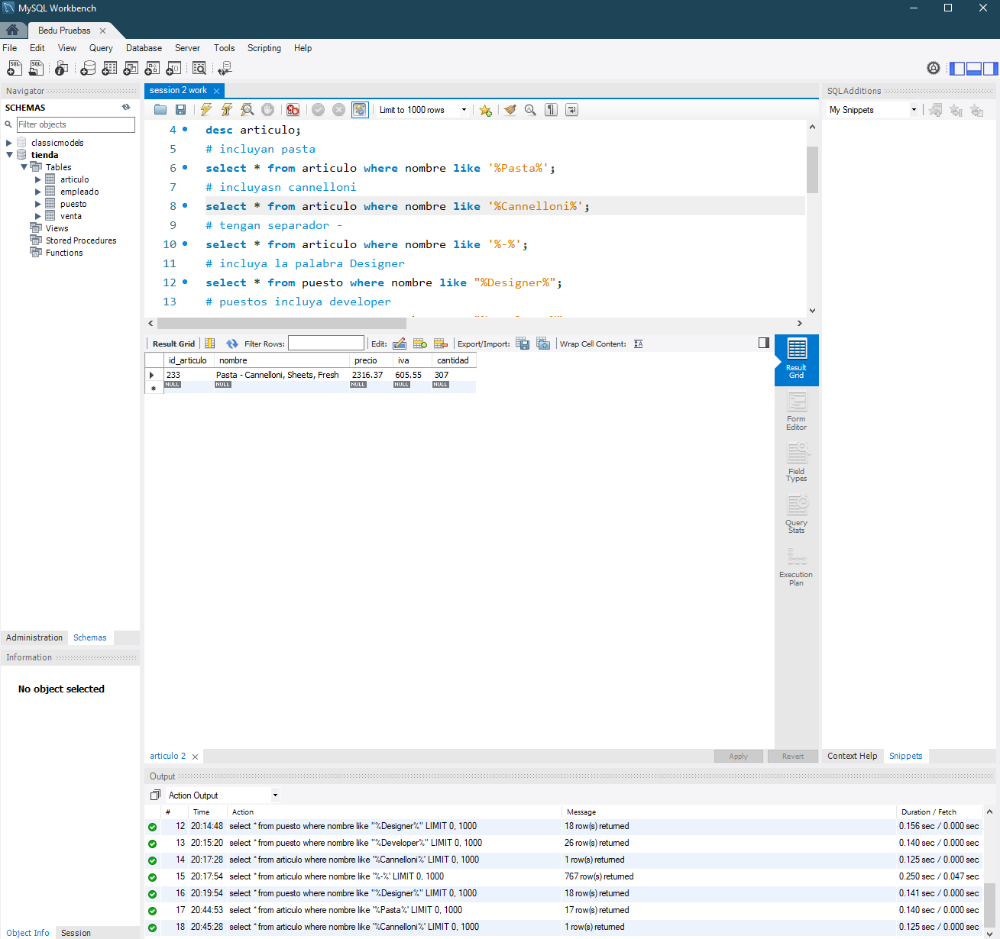
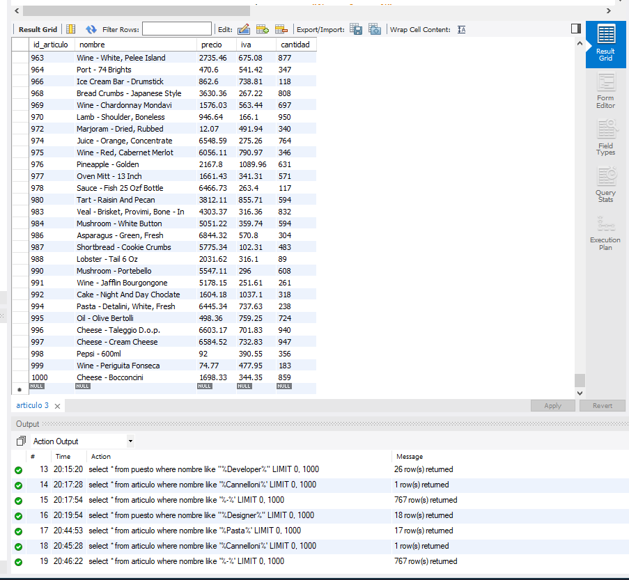
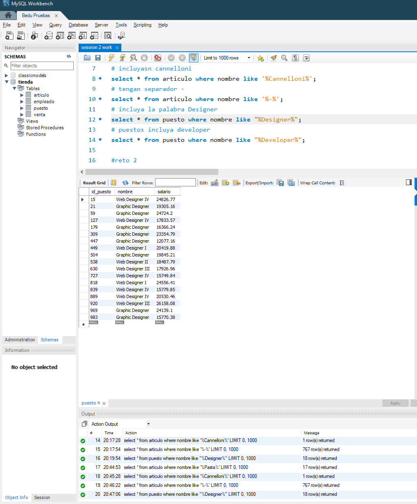
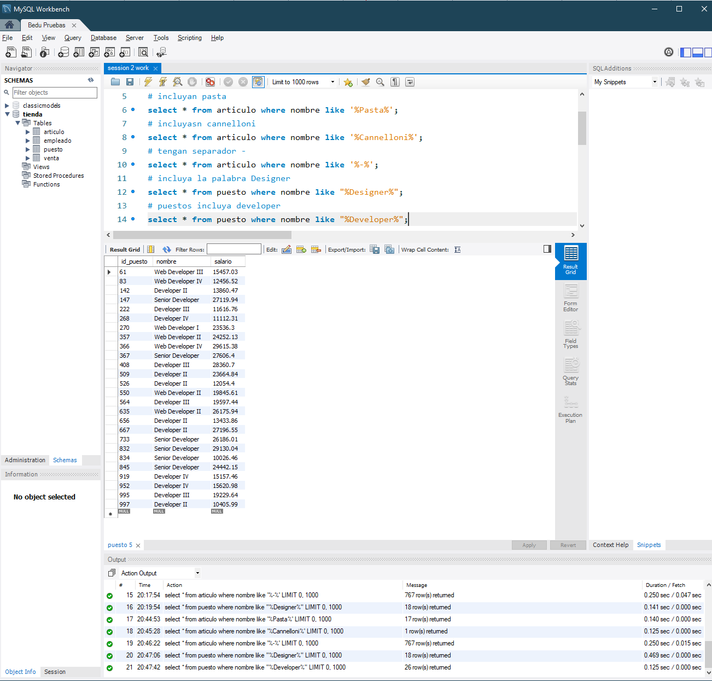

# Retos 1
## ¿Qué artículos incluyen la palabra Pasta en su nombre?

## ¿Qué artículos incluyen la palabra Cannelloni en su nombre?

## ¿Qué nombres están separados por un guión (-) por ejemplo Puree - Kiwi?

## ¿Qué puestos incluyen la palabra Designer?

## ¿Qué puestos incluyen la palabra Developer?

# Reto 2

# Reto 3
