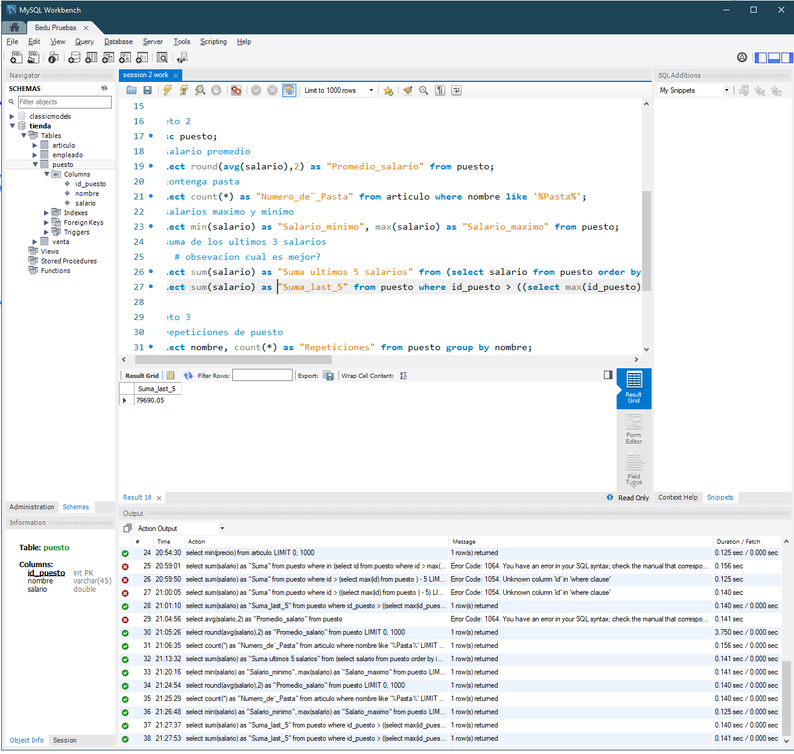

# Retos 1
## ¿Qué artículos incluyen la palabra Pasta en su nombre?

## ¿Qué artículos incluyen la palabra Cannelloni en su nombre?

## ¿Qué nombres están separados por un guión (-) por ejemplo Puree - Kiwi?

## ¿Qué puestos incluyen la palabra Designer?

## ¿Qué puestos incluyen la palabra Developer?

# Reto 2
## ¿Cuál es el promedio de salario de los puestos?

## ¿Cuántos artículos incluyen la palabra Pasta en su nombre?

## ¿Cuál es el salario mínimo y máximo?

## ¿Cuál es la suma del salario de los últimos cinco puestos agregados?

# Reto 3
